<!-- ======================================================== -->
<!--               ABHILASH GHOSH (@djabhi31)                 -->
<!--      Full-Stack Engineer · 3D Web & Creative Technologist -->
<!-- ======================================================== -->

<p align="center">
  <picture>
    <source media="(prefers-color-scheme: dark)" srcset="./dark.svg">
    <source media="(prefers-color-scheme: light)" srcset="./light.svg">
    
  </picture>
</p>

<p align="center">
  <a href="https://abhilashghosh.pages.dev/"></a>
  <a href="https://www.youtube.com/c/djabhimaheshtala"></a>
  <a href="https://open.spotify.com/artist/6cgJwZZxm6WnpGvrIEvdjR"></a>
  <a href="https://www.linkedin.com/in/abhilash-ghosh-8b5a711b1/"></a>
  <a href="mailto:abhilashghosh31@gmail.com"></a>
</p>

---

### ⚡ `SYSTEM.SUMMARY`

> **Engineer, Founder, and Creative Producer** bridging the gap between high-performance software engineering, real-time 3D geospatial intelligence, and sound production.

- 🌍 **Geospatial & 3D Web:** Architect of **[EarthSphere](https://www.earthsphere.in/)** and **[God's Eye View](https://godseyeview.earthsphere.in/)** — real-time planetary monitoring consoles utilizing NASA EONET feeds, Next.js 15, WebGL, and Microsoft Azure.
- 🤖 **AI Products:** Creator of **[ExcuseVerse](https://www.excuseverse.app/)**, a viral AI-driven situational generation engine with 2,500+ curated scenarios across work, academics, and personal life.
- 🎶 **Music & Brand Ecosystem:** Founder of **[Mermaidz Records](https://www.mermaidzrecords.in/)** (independent publishing & distribution across 150+ stores) and independent music creator as **DJ ABHI-Maheshtala** with over **38,000+ subscribers** on YouTube.
- 🎓 **Education & Background:** Master of Commerce (M.Com - Accounting & Finance) at the University of Calcutta · Quality & Process auditing experience at Channelplay Limited.

---

### 🚀 `PRODUCTION BUILDS & PLATFORMS`

<table>
  <tr>
    <td width="50%" valign="top">
      <h3 align="left">🪐 <a href="https://www.earthsphere.in/">EarthSphere</a></h3>
      <p><b>Real-Time Planetary Intelligence Platform</b></p>
      <p>Interactive 3D disaster and environmental tracker powered by NASA EONET feeds, Three.js, MapLibre GL, and React 19 / Next.js 15 with dynamic glassmorphism UI.</p>
      <p>
        
        
        
        
      </p>
    </td>
    <td width="50%" valign="top">
      <h3 align="left">👁️ <a href="https://godseyeview.earthsphere.in/">God's Eye View (Cloud Edition)</a></h3>
      <p><b>Real-Time 3D Planetary Console on Azure</b></p>
      <p>High-altitude planetary observation deck deployed natively on Microsoft Azure, orchestrating global situational awareness paired directly with EarthSphere telemetry.</p>
      <p>
        
        
        
        
      </p>
    </td>
  </tr>
  <tr>
    <td width="50%" valign="top">
      <h3 align="left">🤖 <a href="https://www.excuseverse.app/">ExcuseVerse</a></h3>
      <p><b>AI Situational Generator & Platform</b></p>
      <p>Intelligent web application delivering context-aware, believable excuses in seconds across 3 languages with one-tap social sharing and copy features.</p>
      <p>
        
        
        
        
      </p>
    </td>
    <td width="50%" valign="top">
      <h3 align="left">🎶 <a href="https://www.mermaidzrecords.in/">Mermaidz Records</a></h3>
      <p><b>Music Distribution & Publishing Brand</b></p>
      <p>Digital label and publishing infrastructure empowering independent artists worldwide to release music to Spotify, Apple Music, YouTube Music, and 150+ DSPs.</p>
      <p>
        
        
        
      </p>
    </td>
  </tr>
  <tr>
    <td width="50%" valign="top">
      <h3 align="left">🌍 <a href="https://worldmonitor.app">WorldMonitor</a></h3>
      <p><b>Global Situational Awareness Dashboard</b></p>
      <p>Unified real-time intelligence console aggregating geopolitical developments, breaking global events, and critical infrastructure telemetry.</p>
      <p>
        
        
        
      </p>
    </td>
    <td width="50%" valign="top">
      <h3 align="left">🚀 <a href="https://github.com/djabhi31/github-achievement-unlocker">GitHub Achievement Unlocker</a></h3>
      <p><b>Automated Developer Achievements Tool</b></p>
      <p>1-Click automation tool & GitHub Action to unlock GitHub Badges (Galaxy Brain, Pull Shark, Pair Extraordinaire, Quickdraw) with clean modular code.</p>
      <p>
        
        
        
      </p>
    </td>
  </tr>
</table>

---

### 🛠️ `TECHNICAL ARSENAL`

```text
Languages & Core:     TypeScript · JavaScript (ES6+) · Python · HTML5 · CSS3 · SQL
Frameworks & 3D:      Next.js 15 (App Router, Turbopack) · React 19 · Three.js · WebGL · MapLibre GL
Styling & UI Engine:  TailwindCSS · Glassmorphism · CSS Grid · Motion UI
Cloud & DevOps:       Microsoft Azure · GitHub Actions · Cloudflare Pages · Vercel · Git
Audio & Creative:     FL Studio · Ableton Live · Audio Mixing & Mastering · Video Production
Data & Business:      Process Management · Data Analytics · Financial Accounting · Tally ERP
```

<p align="left">
  <!-- Frontend & 3D -->
  
  <br/>
  <!-- Cloud & Tools -->
  
</p>

---

<h2 align="center">📊 GitHub Contributions & Snake</h2>

<p align="center">
  <picture>
    <source media="(prefers-color-scheme: dark)" srcset="https://raw.githubusercontent.com/djabhi31/github-snake/output/github-snake-dark.svg">
    <source media="(prefers-color-scheme: light)" srcset="https://raw.githubusercontent.com/djabhi31/github-snake/output/github-snake.svg">
    
  </picture>
</p>

<p align="center">
  <sub><i>Interactive contribution snake automatically updated daily via GitHub Actions.</i></sub>
</p>

---

### 📈 `SYSTEM TELEMETRY & ACTIVITY`

<p align="center">
  
  
</p>

<p align="center">
  
</p>

---

### 📰 `MEDIA & PRESS FEATURES`

- 🌟 **[Entrepreneur Hunt](https://entrepreneurhunt.com/dj-abhi-maheshtala-announces-comeback-after-15-year-break-plans-for-new-music-and-own-independent-label)** — *"DJ ABHI-Maheshtala Announces Comeback After 1.5-Year Break, Plans for New Music and Own Independent Label"*
- 🌐 **[IssueWire](https://www.issuewire.com/dj-abhi-maheshtala-crosses-35k-subscribers-expands-reach-globally-1829757196756921)** — *"DJ ABHI-Maheshtala Crosses 35K Subscribers, Expands Reach Globally"*
- 📰 **[DailyHunt](https://m.dailyhunt.in/news/india/english/tycoon+world-epaper-dh4c6a646b987d48f5b87f17d40865f089/dj+abhimaheshtala+announces+comeback+after+15year+break+plans+for+new+music+and+own+independent+label-newsid-dh4c6a646b987d48f5b87f17d40865f089_4f5b8eb058e911f0b17ec7f03560258e)** — *"DJ ABHI-Maheshtala Plans for New Music and Own Independent Label"*

---

### 📬 `CONNECT & COLLABORATE`

<p align="center">
  <a href="https://abhilashghosh.pages.dev/"></a>
  <a href="https://www.youtube.com/c/djabhimaheshtala"></a>
  <a href="https://open.spotify.com/artist/6cgJwZZxm6WnpGvrIEvdjR"></a>
  <a href="https://x.com/DjAbhi31"></a>
  <a href="https://www.instagram.com/djabhi.31"></a>
  <a href="https://www.facebook.com/djabhi31"></a>
  <a href="https://www.linkedin.com/in/abhilash-ghosh-8b5a711b1/"></a>
  <a href="mailto:abhilashghosh31@gmail.com"></a>
</p>

<p align="center">
  <sub>Built with ⚡ &amp; Precision by <b>Abhilash Ghosh</b> · Kolkata, India</sub>
</p>
